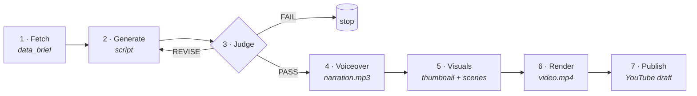
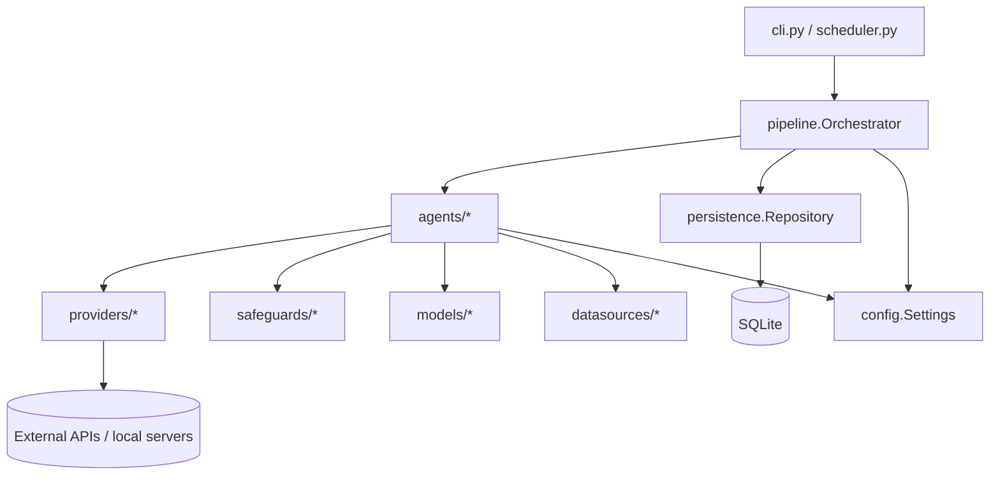
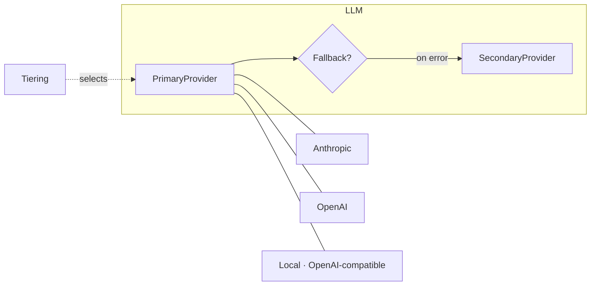

# Content Foundry — Technical Report

**A resumable, grounded, quality-gated multi-agent pipeline for automated long-form video.**

| | |
|---|---|
| **Version** | 1.0.0 |
| **Language** | Python ≥ 3.11 |
| **Source** | 72 modules · ~5,300 LOC |
| **Tests** | 150 passing · ~91% coverage · `ruff` clean |
| **Design spec** | 26 chapters (`spec/`) |
| **License** | MIT |

---

## Abstract

Content Foundry converts **real labor-market data** into a **finished, upload-ready YouTube video**
through seven autonomous agents. The system is built around four hard guarantees that distinguish it
from a naive "prompt-to-video" script:

1. **Grounding** — every statistic in the final script traces back to a concretely fetched data point; ungrounded numbers are mechanically stripped.
2. **Quality gating** — an automated, deterministic-first Judge scores every script against a 7-dimension rubric and blocks weak output from ever reaching production.
3. **Resumability** — each of the seven stages persists a versioned artifact, so any run can be stopped, hand-edited, and resumed from an arbitrary stage without redoing prior work.
4. **Compliance by default** — synthetic-content disclosure is enforced programmatically, and nothing can auto-publish publicly without it.

A fifth cross-cutting concern, **cost control**, lets the entire pipeline run **fully offline and
free** (local LLM + offline TTS + procedural visuals) or scale up to paid cloud providers, selected
per-stage through a uniform provider abstraction.

---

## Table of Contents

1. [Motivation & Goals](#1-motivation--goals)
2. [System Overview](#2-system-overview)
3. [Design Principles](#3-design-principles)
4. [Architecture](#4-architecture)
5. [The Pipeline Orchestrator](#5-the-pipeline-orchestrator)
6. [Data Model & Artifacts](#6-data-model--artifacts)
7. [The Agents](#7-the-agents)
8. [The Judge — Quality Gate](#8-the-judge--quality-gate)
9. [Provider Abstraction](#9-provider-abstraction)
10. [Safeguards & Compliance](#10-safeguards--compliance)
11. [Reliability & Error Handling](#11-reliability--error-handling)
12. [Cost Control & Local-First Operation](#12-cost-control--local-first-operation)
13. [Observability](#13-observability)
14. [Testing Strategy](#14-testing-strategy)
15. [Notable Engineering Decisions](#15-notable-engineering-decisions)
16. [Limitations & Future Work](#16-limitations--future-work)
17. [Technology Stack](#17-technology-stack)
18. [Appendix: Metrics & Glossary](#18-appendix-metrics--glossary)

---

## 1. Motivation & Goals

Automated video generators typically hallucinate facts, produce generic filler, offer no way to
intervene mid-process, and ignore platform disclosure rules. Content Foundry was designed to make
each of those failure modes structurally impossible rather than merely discouraged by a prompt.

**Functional goals**

| ID | Goal |
|----|------|
| **G1** | *Grounded content* — every script cites at least one concrete fetched data point; no hallucinated statistics. |
| **G2** | *Insight enforcement* — a quantified Insight Score gates every script; below threshold ⇒ rejected/revised. |
| **G3** | *Anti-repetition* — the Judge detects "template fatigue" across recent runs and forces a structural shift. |
| **G4** | *Full resumability* — the operator can start the pipeline at any stage from the previous stage's (optionally hand-edited) artifact. |
| **G5** | *Compliance by default* — every output carries the mandatory synthetic-content disclosure, enforced by a hard gate before anything goes public. |

**Non-functional goals:** deterministic where possible (reproducible judging, no needless token
spend), operable by a single person, and runnable at zero marginal cost.

---

## 2. System Overview

The pipeline is a linear seven-stage flow with a single feedback loop between generation and
judging:



| # | Stage | Responsibility | Artifact | LLM? |
|---|-------|----------------|----------|------|
| 1 | **fetch** | Pull job/salary/layoff/news signals; distill grounded facts | `data_brief.json` | No (deterministic) |
| 2 | **generate** | Write the script from the brief | `script.json` | Yes (or local) |
| 3 | **judge** | Score on 7 dimensions → PASS / REVISE / FAIL | `judge_report.json` | Optional (hybrid) |
| 4 | **voiceover** | TTS narration + word-level timings | `voiceover.json`, `narration.mp3` | No |
| 5 | **visuals** | Thumbnail, per-scene images/B-roll, captions | `visuals.json`, `assets/…` | Optional |
| 6 | **render** | Assemble audio + visuals + captions to mp4 | `video.json`, `video.mp4` | No |
| 7 | **publish** | Upload as a Private draft (or dry-run) | `publish_result.json` | No |

**Core agents (1–3)** produce a rubric-approved script; **production agents (4–7)** turn it into a
published video. Stage 3 is a hard gate: production never begins on a failing script.

---

## 3. Design Principles

**Deterministic-first.** Anything that *can* be computed with plain code *is* — data distillation
(stage 1), five of seven Judge dimensions, template-fatigue detection, SEO, and captioning all run
without tokens. LLM calls are reserved for the two genuinely subjective tasks (writing, and scoring
the two subjective rubric dimensions), which minimizes cost and maximizes reproducibility.

**Artifact-per-stage.** Every stage's output is a self-contained, schema-versioned JSON document
written to `output/runs/<run_id>/`. This single decision yields resumability, hand-editability,
auditability, and testability for free — each stage is a pure function from one artifact to the next.

**Protocol-based providers.** Every external capability (LLM, TTS, image, render, upload) sits behind
a `typing.Protocol`. Concrete providers are swapped by configuration; vendor SDKs are imported
lazily so an unused provider never needs to be installed.

**Fail closed on compliance, fail open on data.** A missing data source degrades gracefully (the run
proceeds on the sources that succeeded), but a missing disclosure hard-blocks publication.

---

## 4. Architecture

### 4.1 Package layout

```
src/content_foundry/
├── cli.py            # Typer CLI + Rich progress reporter (entry point)
├── config.py         # pydantic-settings: ~80 typed settings, one source of truth
├── errors.py         # ContentFoundryError hierarchy
├── logging.py        # structlog configuration
├── scheduler.py      # APScheduler cron entry point
├── agents/           # the 7 agents + distillation + judge checks   (10 files)
├── models/           # Pydantic artifact schemas (DataBrief, Script, …)  (11 files)
├── providers/        # LLM / TTS / image / render / upload behind Protocols  (12 files)
├── datasources/      # Adzuna, layoffs RSS, news, BLS fetchers  (7 files)
├── pipeline/         # Orchestrator, run state machine, packaging  (5 files)
├── production/       # timebox, SEO, captioning helpers  (6 files)
├── persistence/      # SQLAlchemy models + repository  (4 files)
├── safeguards/       # grounding, disclosure  (3 files)
├── notifications/    # Telegram / null notifier  (5 files)
├── templates/        # the 6 rotating structural templates  (2 files)
└── prompts/          # externalized prompt text  (1 dir)
```

### 4.2 Layering



The orchestrator is the only component that knows the *sequence* of stages; agents know nothing about
each other and communicate exclusively through persisted artifacts. Configuration is injected from a
single `Settings` object resolved once per process.

---

## 5. The Pipeline Orchestrator

The orchestrator (`pipeline/orchestrator.py`) is a small state machine over the run lifecycle:

```
CREATED → FETCHED → GENERATED → JUDGED → APPROVED
        → VOICED → VISUALIZED → RENDERED → PUBLISHED
  (+ REVISING during the gen⇄judge loop,  + FAILED on unrecoverable error)
```

**Responsibilities**

- **Stage sequencing** with `--from-stage` / `--to-stage` slicing.
- **Resume inference.** For a `FAILED` or partially completed run, the next stage is inferred from
  the artifacts present on disk (a dead render resumes at *render*; a failed judge retries at
  *generate*) — so a resume never needlessly re-fetches or re-pays.
- **Reuse-or-regenerate.** If a stage's artifact already exists it is reused; `--force` regenerates.
- **The generate⇄judge loop.** A `REVISE` verdict feeds the Judge's per-dimension critique back into
  a rewrite, up to `MAX_REVISIONS`. Judge attempts are persisted with a monotonic attempt number
  (offset by prior attempts on resume to avoid uniqueness collisions).
- **Budget enforcement.** Before each paid stage, estimated month-to-date spend is checked against
  `MONTHLY_BUDGET_USD`; when `ENFORCE_BUDGET_CAP` is set, the run hard-stops instead of overspending.
- **Progress reporting.** A pluggable reporter emits `start / step / done / judge / gate / end`
  events, rendered as a live Rich console view or as structured logs.

---

## 6. Data Model & Artifacts

All artifacts are Pydantic v2 models (`models/`), schema-versioned for forward compatibility. The two
central schemas:

**`DataBrief`** — the grounded, citation-ready output of stage 1.

```
DataBrief
├── key_facts: [KeyFact]          # each carries a Citation (source, url, snippet)
├── content_angles: [ContentAngle]
├── coverage: {source: bool}      # which sources succeeded
└── gaps: [str]
```

**`Script`** — the production-aware output of stage 2.

```
Script
├── hook: str
├── scenes: [SceneCue]            # narration, on_screen_text, b_roll_keywords, fact_ref
├── title_options, cta, description, tags, thumbnail_concept
├── word_count, grounded_fact_refs
└── synthetic_disclosure: bool
```

The `fact_ref` on each `SceneCue` is the linchpin of grounding: it is an index into
`DataBrief.key_facts`, and the entire grounding + source-attribution machinery is built on validating
and resolving that reference.

Every artifact carries a `Provenance` block (`produced_by`, `model`, `config_hash`) so any output can
be traced to the exact code, model, and configuration that produced it — including a
`operator_edited` marker when a human hand-tunes an artifact between stages.

---

## 7. The Agents

| Agent | Module | Summary |
|-------|--------|---------|
| **1 · Data Fetcher** | `data_fetcher.py` + `distill.py` | Pulls signals from enabled sources, ranks them, and **deterministically** distills `KeyFact`s and content angles. No LLM. Fails fast if fewer than `MIN_FACTS` grounded facts survive. |
| **2 · Script Generator** | `script_generator.py` | The single always-on LLM call. Builds a template-driven prompt, parses/repairs JSON, strips ungrounded stats, guarantees minimum length, and stamps sources. |
| **3 · Judge** | `judge.py` + `judge_checks.py` | Deterministic-first quality gate (see §8). |
| **4 · Voiceover** | `voiceover.py` | TTS synthesis with word-level timing for caption alignment. |
| **5 · Visuals** | `visuals.py` | Thumbnail + per-scene visuals (AI image, Pexels B-roll, or procedurally-drawn cards) + SRT captions. |
| **6 · Renderer** | `renderer.py` | Assembles audio + visuals + captions into an mp4 via ffmpeg. |
| **7 · Publisher** | `publisher.py` | Uploads to YouTube as a Private draft; writes the human review package. |

### 7.1 Script Generator internals

The generator's `run()` is a short, auditable pipeline of pure-ish transformations:

```
build_prompt → complete(LLM) → parse_json(+reformat retry)
   → coerce_script → repair_grounding → ensure_min_length → stamp_sources
```

- **`coerce_script`** tolerates the messy reality of small local models: an `int` field returned as a
  list (`[3, 5]`), a stringified number, a float, or `null` is normalized to a single valid value
  instead of crashing schema validation.
- **`repair_grounding`** strips any statistic whose scene lacks a valid `fact_ref`, so hallucinated
  numbers cannot survive.
- **`ensure_min_length`** detects an under-generated stub and asks once more for the full script,
  keeping whichever draft is longer.
- **`stamp_sources`** guarantees the source-attribution rule (see §10) in code.

The six rotating **structural templates** (contrarian, myth-buster, data-drop, etc.) supply distinct
beat sheets and default perspectives, and are rotated to defeat template fatigue.

---

## 8. The Judge — Quality Gate

The Judge scores seven dimensions on a 0–10 scale. **Five are computed by plain Python; at most one
cheap LLM call** scores the two subjective dimensions, and even that is skippable via `JUDGE_MODE`.

| Dimension | Weight | Hard floor | Scored by |
|-----------|:------:|:----------:|-----------|
| Actionability | 0.20 | — | LLM (hybrid) |
| Specificity | 0.20 | — | deterministic |
| Grounding | 0.20 | **8.0** | deterministic |
| Insight | 0.20 | **7.0** | LLM (hybrid) |
| Hook & Retention | 0.15 | — | deterministic |
| Structural Freshness | 0.10 | — | deterministic |
| Compliance | 0.05 | pass/fail | deterministic |

The weighted total normalizes the 1.10 weight sum back onto a 0–10 scale:

$$\text{weighted\_total} = \frac{\sum_i w_i \, s_i}{\sum_i w_i}$$

**Grounding** is scored as the fraction of statistics that resolve to a valid fact:

$$\text{grounding} = 10 \cdot \frac{\text{grounded stats}}{\text{total stats}} \quad (=10 \text{ when there are none})$$

**Verdict logic.** A `PASS` requires the weighted total to clear `PASS_THRESHOLD` **and** every hard
gate to hold:

$$\text{PASS} \iff \text{total} \ge \tau \;\wedge\; \text{compliance} \;\wedge\; \text{grounding} \ge 8 \;\wedge\; \text{insight} \ge 7 \;\wedge\; \lnot\text{fatigue} \;\wedge\; \text{complete}$$

Otherwise the run `REVISE`s (feeding a per-dimension critique back to the generator) until it either
passes or exhausts `MAX_REVISIONS`, which yields `FAIL`.

**Completeness gate.** The rubric measures *quality*, not *quantity* — so a grounded but tiny stub
would otherwise score well (a short hook even scores *higher*). A dedicated deterministic gate rejects
drafts that are structurally too short:

$$\text{complete} \iff |\text{scenes}| \ge \text{MIN\_SCENES} \;\wedge\; \text{word\_count} \ge r \cdot \text{SCRIPT\_TARGET\_WORDS}$$

A single-scene draft is rejected **without** spending an LLM call, exactly like a grounding violation.

**Cost-saving short-circuit.** When a deterministic hard gate already decides the verdict (e.g. a
grounding or completeness violation), the subjective LLM pass is skipped entirely — the system spends
tokens on exactly the scripts most likely to pass.

---

## 9. Provider Abstraction

Every external capability is a `Protocol`; providers are chosen by configuration and composed:



- **Fallback chain.** A primary provider failure (after `tenacity` retries) transparently fails over
  to a configured secondary — e.g. cloud → cloud, or cloud → local.
- **Tiered routing.** A *heavy* tier handles hard creative work (scriptwriting); a *light* tier
  handles mechanical, high-volume calls (JSON repair, discrete 1–5 judge scoring). Each tier maps to a
  configurable model, defaulting back to the generator/judge model.
- **Local-first.** `PRIMARY_PROVIDER=local` targets any OpenAI-compatible server (Ollama, LM Studio,
  vLLM, llama.cpp), making generation and judging free.

| Capability | Providers |
|------------|-----------|
| **LLM** | Anthropic · OpenAI · Local (OpenAI-compatible) |
| **TTS** | ElevenLabs · OpenAI · **Edge** (free, online) · **Piper** (free, offline) |
| **Image** | OpenAI · Stability · **none** (procedural cards) + Pexels B-roll |
| **Render** | ffmpeg (with PATH auto-discovery) · MoviePy · Avatar (HeyGen/D-ID) |
| **Publish** | YouTube Data API v3 (OAuth) |

---

## 10. Safeguards & Compliance

Three deterministic safeguards enforce the project's non-negotiable guarantees:

**Grounding** (`safeguards/grounding.py`). A statistic is any `$`, `%`, or multi-digit token. Each is
required to map to a scene `fact_ref` that exists in the `DataBrief`; unmapped stats are stripped
during generation and drive the Judge's grounding score.

**Source attribution** (`stamp_sources`). A hard rule: *a statistic is never shown without its exact
source*. For every scene whose narration still cites a (grounded) stat, the referenced fact's source
is stamped into the on-screen caption (`… · Source: Adzuna`). This runs **in code** after grounding
repair, so the guarantee holds even when the model omits it — and it is idempotent across re-runs.

**Disclosure** (`safeguards/disclosure.py`). `synthetic_disclosure` is always set and surfaced in the
description; a regex verifies the disclosure phrase. The publish path resolves to a hard gate:
`auto + public + no disclosure` can **never** resolve to a public upload — it downgrades to Private,
pending manual disclosure, every time.

The full chain is airtight: ungrounded stats are **stripped** → surviving stats have a **real fact**
→ that fact's **exact source is shown on screen** → nothing publishes public **without disclosure**.

---

## 11. Reliability & Error Handling

A single exception family (`ContentFoundryError`) lets any layer catch the whole hierarchy:

```
ContentFoundryError
├── ConfigError               # fail fast at startup
├── DataSourceError           # one source failed (recoverable)
├── NoDataError               # all sources failed
├── InsufficientDataError     # < MIN_FACTS grounded facts
├── LLMError                  # provider failure after retries + fallback
├── BudgetExhaustedError      # month-to-date spend hit the cap
├── SchemaValidationError     # artifact/JSON invalid
├── GroundingError · TTSError · RenderError · PublishError
```

**Layered policy:**

| Layer | Strategy |
|-------|----------|
| Network (sources, LLM, TTS, image, upload) | `tenacity` exponential backoff, then provider fallback |
| Data sources | Degrade gracefully — proceed on whatever succeeded, as long as ≥ `MIN_FACTS` |
| LLM output | Reformat-retry on bad JSON; type-coercion on malformed fields; strip on ungrounded stats |
| Render | Surface real ffmpeg stderr; optional avatar→ffmpeg fallback |
| Compliance | Fail closed — hard gate, never bypassed |

Failures are recoverable by construction: because each completed stage is persisted, an error at
stage *k* is fixed and the run resumes at *k*, never from the top.

---

## 12. Cost Control & Local-First Operation

Cost is a first-class configuration axis, tunable per stage:

1. **Local LLM** — `PRIMARY_PROVIDER=local` (Ollama); generation & judging free.
2. **Free voice** — `TTS_PROVIDER=edge` (online) or `piper` (offline). *(TTS is the single largest paid cost otherwise.)*
3. **Free visuals** — procedural cards (`IMAGE_PROVIDER=none`) + a free Pexels key for real B-roll.
4. **Deterministic judge** — `JUDGE_MODE=deterministic` spends zero tokens.
5. **Budget cap** — `ENFORCE_BUDGET_CAP` hard-stops a run at the monthly budget.
6. **`--profile cheap`** — bundles the above into one flag.

| Configuration | Approx. cost / video |
|---------------|:--------------------:|
| Fully local (Ollama + Edge/Piper + cards) | **~$0** |
| Local LLM + cloud TTS | ~$0.10 |
| All paid cloud defaults | ~$2 |

---

## 13. Observability

- **Structured logging** via `structlog` — every stage emits machine-parseable events; log level and
  JSON/console format are configurable.
- **Live progress** — a Rich-based reporter renders a spinner and clean per-stage progress lines for
  interactive runs, backed by the same event stream as the logs.
- **Provenance** — every artifact records the producing code, model, and config hash.
- **Review dashboard** — a read-mostly Streamlit UI (`content-foundry dashboard`) to spot-check Judge
  reports, watch for generic-content drift, and approve drafts — the thin human layer that keeps a
  person out of the writing loop but in the approval loop.

---

## 14. Testing Strategy

| Metric | Value |
|--------|-------|
| Test files | 27 |
| Tests | **150 passing** |
| Coverage | **~91%** (gate: 85%) |
| Lint | `ruff` (E, F, I, UP, B, C4, SIM) — clean |
| Type hints | throughout; `mypy` in dev deps |

**Principles.** Tests are **hermetic** — an autouse fixture points the settings loader at a
non-existent dotenv and injects a controlled environment, so a developer's real `.env` can never leak
into a test. External providers are replaced by fakes; the canonical "good script" and "generic
script" fixtures anchor the Judge's behavior.

**Contract tests** lock in the guarantees, e.g.: a script citing an absent number → grounding
short-circuits to `REVISE` with **no** LLM call; a never-passing script stops at `MAX_REVISIONS` →
`FAILED`; a well-formed single-scene stub → rejected by the completeness gate with **zero** tokens; a
scene stating a stat → its source is stamped even when the model omits it.

---

## 15. Notable Engineering Decisions

A selection of decisions and hardening that shaped the current system:

- **Deterministic-first judging.** Moving five of seven rubric dimensions into plain code made the
  quality gate reproducible and nearly free, and enabled the token-saving short-circuit on scripts
  that are doomed to `REVISE`.

- **The completeness gate.** The original rubric scored *quality* but not *quantity*; a grounded
  23-word stub scored ~8/10 and passed (the hook dimension even *rewarded* brevity). A deterministic
  completeness gate — parameterized by `MIN_SCENES` and `MIN_SCRIPT_WORD_RATIO` — now rejects stubs
  before they reach production, closing a class of "technically valid but useless" output.

- **Source attribution as code, not prompt.** Requiring the model to cite sources is unreliable;
  guaranteeing it in a post-processing pass makes the rule unbreakable and idempotent.

- **Defensive coercion for small models.** Local models emit malformed JSON types (a `fact_ref` as a
  list, a stringified index). Rather than fail, the generator normalizes these — a pragmatic
  robustness layer that made the local-first path genuinely usable.

- **Environment-independent ffmpeg discovery.** Rendering auto-discovers ffmpeg across PATH and common
  install locations, sidestepping the frequent "installed but not on this shell's PATH" problem on
  Windows.

- **Call-time settings resolution.** Settings are resolved when first requested (not at import), which
  is what makes the hermetic test environment possible.

---

## 16. Limitations & Future Work

- **Per-scene source precision.** Grounding is scene-level: a scene citing two facts from two sources
  currently surfaces the first fact's source. Per-statistic citation would require a richer
  `SceneCue` schema.
- **Source specificity.** News citations are labeled by category; carrying the exact outlet/domain
  through distillation would sharpen attribution.
- **Revision regression.** Each revision rewrites from scratch, so a weak local model can occasionally
  regress; feeding the Judge's exact reasoning back in mitigates but does not eliminate this. A
  keep-best-attempt strategy is a candidate improvement.
- **Single-niche tuning.** Templates and heuristics are tuned for the careers/labor-market domain;
  generalizing to other niches is future work.

---

## 17. Technology Stack

| Concern | Libraries |
|---------|-----------|
| **Config & models** | `pydantic`, `pydantic-settings` |
| **LLM** | `anthropic`, `openai` (+ any OpenAI-compatible local server) |
| **Data** | `httpx`, `beautifulsoup4`, `lxml`, `python-dateutil` |
| **Persistence** | `SQLAlchemy` + SQLite |
| **CLI & scheduling** | `typer`, `rich`, `APScheduler` |
| **TTS** | `elevenlabs`, `edge-tts`, `piper-tts` |
| **Visuals & render** | `Pillow`, `ffmpeg-python`, `moviepy`, `faster-whisper`, `stability-sdk` |
| **Publishing** | `google-api-python-client`, `google-auth-oauthlib` |
| **Reliability & logging** | `tenacity`, `structlog` |
| **Dashboard** | `streamlit` |
| **Dev** | `pytest`, `pytest-cov`, `pytest-mock`, `respx`, `ruff`, `mypy`, `pre-commit` |

---

## 18. Appendix: Metrics & Glossary

**Codebase**

| | |
|---|---|
| Source modules | 72 files · ~5,288 LOC |
| Tests | 27 files · ~1,785 LOC · 150 passing |
| Design spec | 26 chapters |
| Coverage / lint | ~91% / `ruff` clean |

**Glossary**

- **Artifact** — the versioned JSON (+ media) each stage writes; the unit of resumability.
- **run_id** — a short sequential id (e.g. `0006`) identifying a run; also its folder name under `output/runs/`.
- **Brief** — `data_brief.json`; the grounded facts a script must cite.
- **fact_ref** — a scene's index into `DataBrief.key_facts`; the basis of grounding and source attribution.
- **Verdict** — the Judge's decision: PASS / REVISE / FAIL.
- **Floor** — a per-dimension minimum that must hold regardless of the weighted total.
- **Completeness gate** — the deterministic scene-count/word-count check that rejects stub scripts.
- **Production gate** — the rule that only a PASS (or `--force`) may proceed to voiceover→publish.
- **Disclosure gate** — the rule that nothing goes public without the synthetic-content disclosure.
- **Dry run** — a full pipeline including a real mp4, but no upload.

---

*Content Foundry is specified in 26 chapters under `spec/` and documented for operators in
`Tutorial.md`. This report describes the system as implemented at version 1.0.0.*
