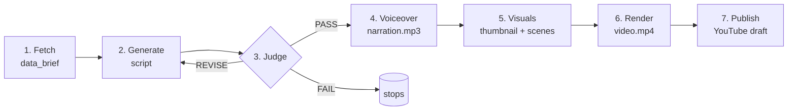

# Content Foundry — Complete Tutorial

An end-to-end guide to running the automated content pipeline: what every stage does, how to run
it, where to find your files, and how to handle every scenario (failures, resumes, cost control,
publishing).

---

## 1. What it is

Content Foundry turns **real labor-market data** into a **finished, upload-ready YouTube video**
through 7 automated stages. Every stage writes a versioned artifact to disk, so a run is fully
**resumable** — if something fails at stage 5, you fix it and continue from stage 5; nothing earlier
is redone.

It is **grounded** (every stat traces to fetched data), **quality-gated** (an automated Judge
scores each script and blocks weak ones), and **compliance-safe** (synthetic-content disclosure is
enforced; nothing auto-publishes public without it).

---

## 2. The pipeline (stages & flow)



| # | Stage name | What it does | Writes | Uses money? |
|---|-----------|--------------|--------|-------------|
| 1 | **fetch** | Pulls job/salary/layoff/news signals, distills grounded facts (no LLM) | `data_brief.json` | data-source keys (mostly free) |
| 2 | **generate** | Writes the script from the brief (the one always-on LLM call); also authors optional `sfx` cues | `script.json` | LLM (or **free** local) |
| 3 | **judge** | Scores the script on 10 dimensions; PASS / REVISE / FAIL | `judge_report.json` | LLM (hybrid) or **free** deterministic |
| 4 | **voiceover** | Text-to-speech narration + word timings | `voiceover.json`, `assets/narration.mp3` | TTS (or **free** Edge/Piper) |
| 5 | **visuals** | Thumbnail + per-scene images/B-roll + captions | `visuals.json`, `assets/thumbnail.png`, `assets/scenes/`, `assets/captions.srt` | image API (or **free** cards/Pexels) |
| 6 | **render** | Assembles audio + visuals + captions into an mp4 (ffmpeg); mixes any `sfx` cues in | `video.json`, `assets/video.mp4` | free (local) |
| 7 | **publish** | Uploads to YouTube as a Private draft (or dry-run) | `publish_result.json` | free |

Generate ⇄ Judge is a **loop**: a REVISE verdict feeds the Judge's critique back into a rewrite, up
to `MAX_REVISIONS` times. A PASS proceeds to production; exhausting the attempts is a FAIL.

**Run states** progress: `CREATED → FETCHED → GENERATED → JUDGED → APPROVED → VOICED → VISUALIZED →
RENDERED → PUBLISHED` (plus `REVISING` during the loop and `FAILED`).

---

## 3. Quick start (100% free, offline)

**Prerequisites** (one time):
- Python 3.11+, and ffmpeg (`winget install Gyan.FFmpeg` — then **fully restart your editor**).
- [Ollama](https://ollama.com) for a free local LLM: `ollama pull qwen2.5:7b-instruct`
- `pip install edge-tts` (free voice; already a dependency).

**.env** (copy from `.env.example`, then set):
```ini
PRIMARY_PROVIDER=local
FALLBACK_PROVIDER=none
LOCAL_LLM_BASE_URL=http://localhost:11434/v1
LOCAL_LLM_MODEL=qwen2.5:7b-instruct
TTS_PROVIDER=edge
TTS_VOICE_ID=en-US-AriaNeural
IMAGE_PROVIDER=none
ENABLED_SOURCES=search               # keyless, works on ANY niche (DuckDuckGo). Career feeds: adzuna,layoffs,bls
LAYOFFS_FEED_URL=https://layoffs.fyi/feed/
NOTIFY_ENABLED=false
```

**Validate + first run:**
```powershell
content-foundry config check                          # confirms keys/config (redacted)
content-foundry run --niche "tech careers" --dry-run  # full pipeline, no upload
```
The `--dry-run` still produces a real `assets/video.mp4` — it just skips the YouTube upload.

---

## 4. Your first run — reading the output

```
▶ content-foundry  niche tech careers  ·  fetch → publish
  ✓ Data brief  — 8 facts · search
  ⚖ attempt 1 → PASS  score 8.10/10 · insight 8.0
  ✓ Voiceover (TTS)
  ✓ Visuals & thumbnail
  ✓ Rendering video
  ✓ Publishing

run_id 0006   state PUBLISHED   verdict PASS
  data_brief   output\runs\0006\data_brief.json
  script       output\runs\0006\script.json
  ...
```

- **The `run_id`** (e.g. `0006`) is a short, sequential number printed on the last lines — you use
  it to resume, inspect, or publish that run later. It's just the next number after the highest run
  folder under `output\runs\`, so it's easy to type (`--run-id 0006`). It's also the **folder name**.
- Each `⚖ attempt` line shows the Judge verdict + score, so you see exactly why a script passed or
  needed revision.

---

## 5. Where everything lives

Every run gets its own folder:
```
output/runs/<run_id>/
├── data_brief.json        # stage 1 — the grounded facts
├── ideas.json             # the brainstormed ideas + the exact one this run picked
├── script.json            # stage 2 — the script (edit this to hand-tune)
├── judge_report.json      # stage 3 — scores + the critique
├── voiceover.json         # stage 4
├── visuals.json           # stage 5
├── video.json             # stage 6
├── publish_result.json    # stage 7
├── package.md             # human summary + the MANDATORY disclosure checklist
└── assets/
    ├── narration.mp3
    ├── thumbnail.png
    ├── captions.srt
    ├── scenes/            # one image/clip per scene
    └── video.mp4          # ← the finished video
```

**Finding a run_id later:**
```powershell
content-foundry list                 # recent runs: run_id, state, verdict, created_at
content-foundry list --state FAILED  # filter by state
```
or just look at the folder names in `output\runs\`.

---

## 6. CLI command reference

Global flags go **before** the command: `content-foundry --profile cheap --dry-run run …`

| Command | Purpose |
|---|---|
| `run` | Full pipeline (or a slice via `--from-stage`/`--to-stage`) |
| `fetch` | Stage 1 only → `data_brief.json` |
| `generate --input data_brief.json` | Stage 2 only |
| `judge --input script.json` | Stage 3 only |
| `voiceover --run-id <id>` | Stage 4 |
| `visuals --run-id <id>` | Stage 5 |
| `render --run-id <id> [--backend ffmpeg]` | Stage 6 |
| `publish --run-id <id> [--dry-run] [--privacy private] [--mode draft]` | Stage 7 |
| `resume --run-id <id> [--to-stage publish]` | **Continue a run from its next stage automatically** |
| `status --run-id <id>` | State, verdict, and a table of attempts/scores |
| `list [--limit 20] [--state FAILED]` | Recent runs |
| `report --run-id <id>` | Pretty-print the Judge report (per-dimension scores) |
| `dashboard [--port 8501]` | Launch the Streamlit review UI |
| `init-db` | Create the database tables (auto-run anyway) |
| `config check [--profile cheap]` | Validate `.env`; redacted credential table |
| `notify-test` | Send a sample of each alert to verify your bot |
| `schedule [--cron "0 9 * * MON"]` | Run on a schedule |

Key `run` options: `--niche`, `--topic`, `--idea`, `--template`, `--from-stage`, `--to-stage`, `--run-id`,
`--input`, `--force`, `--dry-run`. `--idea "resume optimization"` **focuses** the brainstormer on your
concept — it proposes a few specific angles and (in a terminal) asks you to pick one, or choose `0` to
type your own idea instead, before writing.

---

## 7. Understanding the Judge

The Judge scores 10 dimensions (0–10). Some have **hard floors** — miss a floor and it's a REVISE
no matter the total:

| Dimension | Weight | Floor | How scored |
|---|---|---|---|
| Actionability | 14% | — | LLM (hybrid) |
| Specificity | 14% | — | deterministic |
| Factual Grounding | 14% | **`GROUNDING_MIN` (8.0)** | deterministic |
| Insight | 14% | **`INSIGHT_MIN` (7.0)** | LLM (hybrid) |
| Engagement | 10% | — | LLM (hybrid) |
| Wittiness | 7% | **`WITTINESS_MIN` (5.0)** | LLM (hybrid) |
| Ending / Sign-off | 7% | **`ENDING_MIN` (6.0)** | deterministic |
| Hook & Retention | 10% | — | deterministic |
| Structural Freshness | 7% | — | deterministic |
| Compliance | 3% | pass/fail | deterministic |

- **PASS**: weighted total ≥ `PASS_THRESHOLD` (7.5) **and** all floors met.
- **REVISE**: a floor missed or total too low → the Judge's critique is fed into a rewrite.
- **FAIL**: never passed within `MAX_REVISIONS` (usually a *data* problem, not writing).

**Completeness gate (hard).** Independent of the score, a script is REVISEd if it's too short — fewer
than `MIN_SCENES` (3) scenes **or** below `MIN_SCRIPT_WORD_RATIO × SCRIPT_TARGET_WORDS` words (default
`0.5 × 900 = 450`). This is why a script can score **8+/10 and still not PASS**: high quality but too
short — `report` shows a `LENGTH:` line when it fires. If your local model under-produces, lower
`SCRIPT_TARGET_WORDS` (e.g. `350`) or use a bigger model. Every statistic also carries its **source**
on screen (`… · Source: Adzuna`), enforced in code so a stat can never appear un-sourced.

**Gate relief.** A draft scoring ≥ `GATE_RELIEF_SCORE` (9.0) earns `GATE_RELIEF_RATIO` (20%) slack on
the **insight** and **length** floors — so a near-miss doesn't block an otherwise-excellent script
(the report `summary` says when relief was applied). Grounding, compliance, and anti-repetition are
**never** relaxed.

Inspect it: `content-foundry report --run-id <id>` shows every dimension's score + the reasoning.

`JUDGE_MODE`: `hybrid` (default, 1 small LLM call), `deterministic` (0 LLM, heuristics only — free
& fast), or `llm` (all dims by LLM).

---

## 8. Resuming & partial runs (the important part)

Because every stage persists an artifact, you can start/stop anywhere. Two mechanisms:

**A) `resume` — automatic.** It looks up the run's state and continues from the *next* stage:
```powershell
content-foundry resume --run-id <id>                 # e.g. JUDGED → voiceover onward
content-foundry resume --run-id <id> --to-stage render
```
If the run **FAILED**, resume figures out the right restart point from the artifacts on disk — a
script that failed judging retries from **generate**, a render that died resumes from **render** —
so it never needlessly re-fetches.

**B) `run --from-stage / --to-stage` — explicit.** Full control:
```powershell
# Re-do generation+judge (e.g. after switching the model), then stop at judge:
content-foundry run --run-id <id> --from-stage generate --to-stage judge --dry-run

# Continue from voiceover to the end (after a PASS):
content-foundry run --run-id <id> --from-stage voiceover --dry-run
```

**Reuse is automatic:** if an artifact for a stage already exists, it's reused (no re-paying for
TTS/images). Add `--force` to regenerate it anyway.

**Hand-editing:** stop after judge, open `script.json`, edit the narration, then resume from
voiceover — the edit is detected and provenance is stamped `operator_edited`:
```powershell
content-foundry run --run-id <id> --from-stage voiceover --dry-run
```

---

## 9. Configuration (.env groups)

| Group | Key settings |
|---|---|
| **LLM** | `PRIMARY_PROVIDER` (anthropic\|openai\|**local**), `FALLBACK_PROVIDER`, `LOCAL_LLM_BASE_URL`, `LOCAL_LLM_MODEL`, `GENERATOR_MODEL`, `JUDGE_MODEL` |
| **Data** | `ENABLED_SOURCES` (adzuna\|layoffs\|news\|bls\|**search**), `ADZUNA_APP_ID/KEY`, `NEWSAPI_KEY`, `LAYOFFS_FEED_URL` |
| **Web search** | `SEARCH_PROVIDER` (**duckduckgo** no-key\|tavily\|brave), `TAVILY_API_KEY`, `BRAVE_API_KEY`, `SEARCH_MAX_RESULTS`, `SEARCH_QUERY_COUNT`, `SEARCH_FACETS` (multi-query fan-out) |
| **Pipeline** | `MAX_REVISIONS`, `JUDGE_MODE`, `PASS_THRESHOLD`, `INSIGHT_MIN`, `GROUNDING_MIN`, `MIN_FACTS`, `MAX_FACTS`, `MIN_SCENES`, `MIN_SCRIPT_WORD_RATIO`, `GATE_RELIEF_SCORE`, `GATE_RELIEF_RATIO`, `BRAINSTORM_ENABLED`, `BRAINSTORM_IDEA_COUNT`, `REQUIRE_SCRIPT_APPROVAL`, `TARGET_NICHE`, `SCRIPT_TARGET_WORDS`, `FAIL_FAST_SCORE` |
| **Voice** | `TTS_PROVIDER` (elevenlabs\|openai\|**edge**\|**piper**), `TTS_VOICE_ID`, `TTS_VOICE_MALE`/`TTS_VOICE_FEMALE` (alternate narrator by run-id parity), `PIPER_MODEL_PATH` |
| **Visuals** | `IMAGE_PROVIDER` (openai\|stability\|**none**), `PEXELS_API_KEY`, `PIXABAY_API_KEY` (2nd free B-roll source), `SCENES_PER_VIDEO` |
| **Render** | `RENDER_BACKEND`, `FFMPEG_PATH` (blank = auto-discover), `VIDEO_RESOLUTION`, `VIDEO_SPEED`, `AVATAR_OVERLAY_ENABLED` |
| **Scene polish** | `SCENE_TRANSITION` (fade/dissolve/…), `SCENE_TRANSITION_SEC`, `COLOR_WARMTH` (warm grade), `SUBSCRIBE_NUDGE_ENABLED` |
| **Sound FX** | `SFX_ENABLED`, `SFX_DIR` (local clip library), `FREESOUND_API_KEY` (optional), `SFX_VOLUME_DB` |
| **Publish** | `PUBLISH_MODE` (draft\|auto), `YOUTUBE_PRIVACY_STATUS`, `REQUIRE_MANUAL_DISCLOSURE_BEFORE_PUBLIC` |
| **Budget** | `MONTHLY_BUDGET_USD`, `ENFORCE_BUDGET_CAP` (hard stop when over budget) |

> ⚠️ In `.env`, don't put a trailing `# comment` on a **blank** value line (e.g. `MODEL_HEAVY= # …`)
> — the comment becomes the value. Put the comment on the line above.

---

## 10. Cost control

Cheapest → most expensive:
1. **Local LLM** — `PRIMARY_PROVIDER=local` (Ollama). Generation is free.
2. **Free voice** — `TTS_PROVIDER=edge` (online, no key) or `piper` (offline). *(TTS is the biggest paid cost.)*
3. **Free visuals** — `IMAGE_PROVIDER=none` (polished cards) + a free Pexels key for real B-roll.
4. **`--profile cheap`** — deterministic judge + cards + a single revision, in one flag.
5. **Budget cap** — `ENFORCE_BUDGET_CAP=true` aborts a run once estimated month-to-date spend hits
   `MONTHLY_BUDGET_USD`.

Rough per-video cost: **~$0** fully local, **~$0.10** with cloud TTS, **~$2** on all paid defaults.

---

## 11. Publishing to YouTube

- **Always test first with `--dry-run`** — produces the full video locally, no upload.
- For real uploads you need the one-time Google OAuth setup (see `Human_Tasks.txt` §4:
  create a Google Cloud project → enable YouTube Data API v3 → OAuth desktop credentials →
  `secrets/client_secrets.json`).
- **Safety by default:** videos upload **Private** as a draft (`PUBLISH_MODE=draft`). A video can
  **never** go public while `REQUIRE_MANUAL_DISCLOSURE_BEFORE_PUBLIC=true` and you haven't ticked
  "Altered or synthetic content" in YouTube Studio. See `package.md`'s disclosure checklist.
- Real publish: `content-foundry publish --run-id <id>` (no `--dry-run`); first run opens a browser
  consent once and caches `secrets/youtube_token.json`.

---

## 12. The dashboard

```powershell
content-foundry dashboard        # opens http://localhost:8501
```
A read-mostly Streamlit UI to spot-check the Judge report, watch for generic-content drift, and
approve drafts — the thin human layer. You're never in the writing loop.

---

## 13. Troubleshooting & scenarios

| Situation | What to do |
|---|---|
| **"ffmpeg not found"** | It auto-discovers now; if it still can't find it, set `FFMPEG_PATH=` to your `ffmpeg.exe`, or **fully restart your editor** so the PATH refreshes (reopening a terminal isn't enough). |
| **`ollama`/`ffmpeg` missing after reopening a terminal** | VS Code caches its environment at launch. **Quit and reopen VS Code entirely** (or reboot). The app talks to Ollama over HTTP, so it doesn't need the `ollama` CLI on PATH — only ffmpeg matters for rendering. |
| **Run ends `FAILED` / verdict `FAIL`** | The script never cleared the Judge's floors in `MAX_REVISIONS` tries. Run `content-foundry report --run-id <id>` and read `revision_instructions` — the failing gate is named there. Usually **length** (too short), **insight**, or **grounding**. |
| **Scored high (8+) but still `FAILED`** | The **completeness gate**: the script is too short (< `MIN_SCENES` scenes or < `MIN_SCRIPT_WORD_RATIO`×`SCRIPT_TARGET_WORDS` words). `report` shows a `LENGTH:` note. Lower `SCRIPT_TARGET_WORDS` (e.g. `350` for a 7B local model) or use a bigger model like `qwen2.5:14b`. |
| **Score too low / insight floor** | Use a stronger model (`LOCAL_LLM_MODEL=qwen2.5:7b-instruct` beats llama3.1), lower `INSIGHT_MIN` for testing, or use `--profile cheap` (deterministic judge skips the insight LLM floor). |
| **Score went *down* on a revision** | Each revision rewrites from scratch, so a weak model can regress. The revision prompt now feeds the Judge's exact reasoning back in to reduce this. |
| **"insufficient facts" / no data** | A data source returned too little. Add real Adzuna keys, verify `LAYOFFS_FEED_URL` (try `https://layoffs.fyi/feed/`), or enable `bls` (keyless). Need ≥ `MIN_FACTS` (3). |
| **Any niche / the feeds don't fit your topic** | Add `search` to `ENABLED_SOURCES` (e.g. `ENABLED_SOURCES=search` for search-only, or `adzuna,search`). It runs a web search on your run's topic (`--niche` + `--idea`), so it works for **any** subject — not just jobs/layoffs. Free via DuckDuckGo (no key); set `SEARCH_PROVIDER=tavily` or `brave` with a free key for a stronger index. |
| **A data source failed** | Runs degrade gracefully — the `✓ Data brief` line shows which sources succeeded. As long as ≥3 facts come back, it proceeds. |
| **Want to resume after a crash** | `content-foundry resume --run-id <id>` — it continues from the next stage; completed stages are reused. |
| **Change the model and retry** | Edit `LOCAL_LLM_MODEL`, then `content-foundry run --run-id <id> --from-stage generate --dry-run`. |
| **Want a real video but no upload** | `--dry-run`. The mp4 is at `output\runs\<id>\assets\video.mp4`. |
| **Want better visuals** | Get a free Pexels key (`PEXELS_API_KEY`) for real B-roll, or set `IMAGE_PROVIDER=openai`/`stability` (paid) for AI images. |
| **Repetitive / off-topic B-roll** | Add a free `PIXABAY_API_KEY` alongside Pexels so each scene draws from a bigger, mixed pool. Clips are now pulled per keyword (per scene), never repeat back-to-back, cap at 2 uses each, and are seeded by the run id so different runs pick different clips. |
| **Want sound effects** | Set `SFX_ENABLED=true`. The script author writes short `sfx` cues (whoosh, ding, cash register…) into scenes and the renderer mixes the matching clip from `data/sounds` in at each cue's moment. Add more clips to that folder or set `FREESOUND_API_KEY` to auto-download missing ones; tune loudness with `SFX_VOLUME_DB`. |
| **Smoother look / branding** | `SCENE_TRANSITION=fade` crossfades between scenes (`fadewhite` = a light flash); `COLOR_WARMTH=0.25` warms the whole grade; `SUBSCRIBE_NUDGE_ENABLED=true` pops a small Subscribe badge at the midpoint. All three are render-only — apply them to an existing run with `content-foundry run --run-id <id> --from-stage render`. |
| **Telegram 404 / notification error** | Harmless with placeholder tokens. Set `NOTIFY_ENABLED=false`, or add a real bot token (`Human_Tasks.txt` §5). |
| **Config won't load** | `content-foundry config check` prints the exact validation error. |
| **Budget hit** | `ENFORCE_BUDGET_CAP=true` stopped the run. Raise `MONTHLY_BUDGET_USD` or set it false. |
| **Duplicate/odd results** | Signals are cached for `SIGNAL_CACHE_TTL_MIN` (12h). Wait or lower the TTL to force a refetch. |

---

## 14. Glossary

- **Artifact** — the versioned JSON (+ media) each stage writes; the unit of resumability.
- **run_id** — the short sequential number (e.g. `0006`) identifying a run; also its folder name under `output\runs\`.
- **Brief** — `data_brief.json`; the grounded facts the script must cite.
- **Verdict** — the Judge's decision: PASS / REVISE / FAIL.
- **Floor** — a minimum score a dimension must hit (grounding, insight) regardless of the total.
- **Production gate** — the check that only a PASS (or `--force`) may proceed to voiceover→publish.
- **Disclosure gate** — the non-negotiable rule that nothing goes public without the synthetic-content disclosure.
- **Dry run** — full pipeline including a real mp4, but no YouTube upload.
