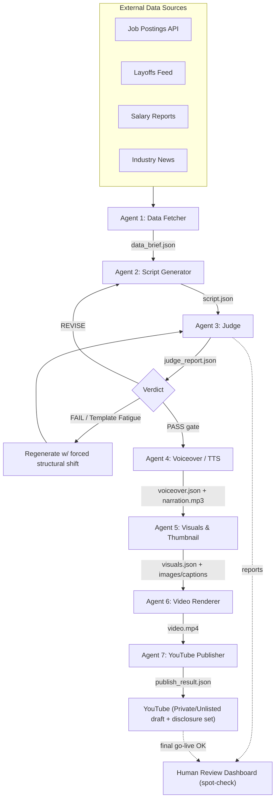

## 2. System Architecture

### 2.1 Architectural style
A **linear, artifact-passing pipeline** with seven stages (three content stages + four production/publishing stages). Each stage is a pure function of its input artifact plus configuration: `stage(input_artifact, config) -> output_artifact`. Stages communicate **only** through versioned JSON artifacts (and referenced media files) persisted to disk and the database. This is what makes the system resumable, testable, and inspectable.

### 2.2 Data flow diagram

### 2.3 The artifact contract (resumability backbone)
Every stage reads one artifact and writes one artifact. Because each artifact is a self-contained, schema-validated JSON file, the operator can:
1. Run only stage 1, inspect/edit `DataBrief.json`, then run stage 2 with that file as input.
2. Skip stage 1 entirely by hand-authoring a `DataBrief.json`.
3. Re-run only the Judge against an externally edited `Script.json`.

Each artifact carries a `schema_version`, the `run_id`, the producing `stage`, and a `provenance` block (what produced it, when, with which model/config hash).

### 2.4 Run lifecycle
- A **Run** = one end-to-end effort to produce a published video, identified by a short sequential `run_id` (4 digits, e.g. `0001`, `0002` — the next number after the highest existing run folder). `attempt_id`/`artifact_id` remain ULIDs internally.
- A run moves through states: `CREATED → FETCHED → GENERATED → JUDGED → APPROVED → VOICED → VISUALIZED → RENDERED → PUBLISHED`, with `REVISING` (Generator⇄Judge loop) and `FAILED` as branches.
- The Judge verdict `PASS` is a **hard gate**: the production stages (4–7) run only after approval.
- The **revision loop** (Generator ⇄ Judge) is bounded by `MAX_REVISIONS` (default 3). Each revision is a new attempt linked to the same run, preserving full history.
- All artifacts and media for a run live under `output/runs/<run_id>/` (JSON artifacts at the top level, media under `assets/`).

### 2.5 Component responsibilities
| Component | Responsibility | Key boundary |
|-----------|----------------|--------------|
| **Orchestrator** | Sequences stages, manages run state, enforces revision loop & resumability | Knows nothing about *how* each agent works |
| **Agents** | Each owns one transformation; LLM-backed where relevant | Pure-ish: input artifact → output artifact |
| **LLM Provider layer** | Abstracts Claude/OpenAI behind one interface; retries, fallback | Agents never call SDKs directly |
| **Data Source layer** | Pluggable fetchers behind a `DataSource` interface | Generator/Judge never touch the network |
| **Media Provider layer** | Abstracts TTS, image-gen, B-roll & render backends behind interfaces | Production agents never call vendor SDKs directly |
| **Publishing layer** | YouTube OAuth + `videos.insert`; sets privacy & disclosure | The only component that touches the channel |
| **Persistence** | DB (run/artifact metadata) + filesystem (artifact & media bodies) | Single source of truth for run state |
| **CLI / Scheduler** | Entry points that invoke the Orchestrator | Thin — no business logic |
| **Notifier** | Pushes alerts (Telegram) on key events; tracks spend for low-credit warnings | Best-effort; never blocks/fails a run |
| **Dashboard** | Read-mostly view over runs, reports, verdicts | Never mutates pipeline logic |

### 2.6 Design principles
- **Determinism where possible:** Fixed seeds/temperature config, content-hash provenance, so a run is reproducible and auditable.
- **LLM only where it adds value (cost discipline):** The expensive LLM is reserved for the one task it is uniquely good at — **creative script writing (Agent 2)**. Data distillation (Agent 1), most of the Judge's rubric, and visual-prompt building are **deterministic code**: free, faster, and hallucination-proof. The Judge's four subjective dimensions use a single optional LLM call (`JUDGE_MODE`), skipped entirely when a deterministic gate already fails.
- **Fail loud, fail isolated:** A failing data source degrades gracefully (partial brief) rather than crashing the run; an LLM failure retries then surfaces a clear error.
- **Separation of concerns:** Network ⊥ generation ⊥ evaluation ⊥ orchestration. Each is independently testable with mocks.
- **Everything is an artifact:** If it matters, it is a persisted, schema-validated JSON file you can read, diff, and edit by hand.

---

---
[← Index](README.md) · [← Prev](01-project-overview-goals.md) · [Next →](03-technology-stack-dependencies.md)
