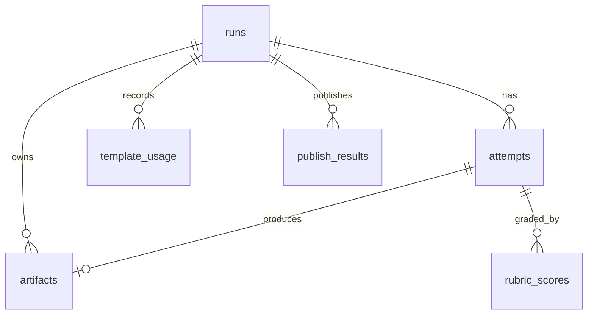

## 5. Database Schema

The database stores **run state and metadata** for querying, history, dashboards, and template-fatigue detection. Artifact *bodies* live as JSON files; the DB holds pointers (`path` + `content_hash`) plus the denormalized fields the dashboard needs. Engine: SQLite via SQLAlchemy 2.0 (swap to Postgres by changing `DATABASE_URL`).

### 5.1 Entity overview


### 5.2 DDL (authoritative, SQLite dialect)
```sql
-- A Run = one end-to-end effort to produce a publishable script.
CREATE TABLE runs (
    run_id           TEXT PRIMARY KEY,                 -- sequential 4-digit (e.g. 0001, 0002)
    topic_seed       TEXT,                             -- optional operator-provided angle
    state            TEXT NOT NULL,                    -- CREATED|FETCHED|GENERATED|JUDGED|APPROVED|REVISING|FAILED
    final_verdict    TEXT,                             -- PASS|REVISE|FAIL (nullable until judged)
    approved_attempt_id TEXT,                          -- FK -> attempts.attempt_id (nullable)
    created_at       TEXT NOT NULL DEFAULT (datetime('now')),
    updated_at       TEXT NOT NULL DEFAULT (datetime('now'))
);

-- Each generation+judging cycle within a run (revision loop produces multiple).
CREATE TABLE attempts (
    attempt_id       TEXT PRIMARY KEY,                 -- ULID
    run_id           TEXT NOT NULL REFERENCES runs(run_id) ON DELETE CASCADE,
    attempt_number   INTEGER NOT NULL,                 -- 1-based
    template_id      TEXT NOT NULL,                    -- e.g. 'problem_solution'
    forced_shift     INTEGER NOT NULL DEFAULT 0,       -- 1 if Judge forced a structural shift
    verdict          TEXT,                             -- PASS|REVISE|FAIL
    insight_score    REAL,                             -- 0-5 (denormalized for dashboard)
    weighted_total   REAL,                             -- 0-5 overall rubric score
    created_at       TEXT NOT NULL DEFAULT (datetime('now')),
    UNIQUE(run_id, attempt_number)
);

-- Pointers to artifact JSON bodies on disk (one row per stage output).
CREATE TABLE artifacts (
    artifact_id      TEXT PRIMARY KEY,                 -- ULID
    run_id           TEXT NOT NULL REFERENCES runs(run_id) ON DELETE CASCADE,
    attempt_id       TEXT REFERENCES attempts(attempt_id) ON DELETE CASCADE, -- null for data_brief
    stage            TEXT NOT NULL,                    -- data_brief|script|judge_report|voiceover|visuals|video|publish|package
    schema_version   TEXT NOT NULL,                    -- e.g. '1.0'
    path             TEXT NOT NULL,                    -- output/runs/<run_id>/<stage>.json
    content_hash     TEXT NOT NULL,                    -- sha256 of file body
    provenance       TEXT,                             -- JSON: {model, config_hash, source_coverage,...}
    created_at       TEXT NOT NULL DEFAULT (datetime('now'))
);

-- Per-dimension rubric scores (one row per dimension per attempt) for analytics.
CREATE TABLE rubric_scores (
    id               INTEGER PRIMARY KEY AUTOINCREMENT,
    attempt_id       TEXT NOT NULL REFERENCES attempts(attempt_id) ON DELETE CASCADE,
    dimension        TEXT NOT NULL,                    -- actionability|specificity|grounding|insight|hook|fatigue|compliance
    score            REAL NOT NULL,                    -- 0-5
    weight           REAL NOT NULL,                    -- rubric weight used
    passed           INTEGER NOT NULL,                 -- 1/0 vs. dimension minimum
    comment          TEXT                              -- Judge's justification
);

-- Tracks which template was used when, for template-fatigue detection.
CREATE TABLE template_usage (
    id               INTEGER PRIMARY KEY AUTOINCREMENT,
    run_id           TEXT NOT NULL REFERENCES runs(run_id) ON DELETE CASCADE,
    template_id      TEXT NOT NULL,
    used_at          TEXT NOT NULL DEFAULT (datetime('now'))
);

-- Optional cache of normalized data signals to avoid refetching within a TTL.
CREATE TABLE signal_cache (
    id               INTEGER PRIMARY KEY AUTOINCREMENT,
    source           TEXT NOT NULL,                    -- adzuna|layoffs|news|bls|search
    fetched_at       TEXT NOT NULL DEFAULT (datetime('now')),
    payload          TEXT NOT NULL                     -- JSON list of NormalizedSignal
);

-- Records of YouTube uploads (one per successful publish attempt).
CREATE TABLE publish_results (
    id               INTEGER PRIMARY KEY AUTOINCREMENT,
    run_id           TEXT NOT NULL REFERENCES runs(run_id) ON DELETE CASCADE,
    attempt_id       TEXT REFERENCES attempts(attempt_id) ON DELETE CASCADE,
    youtube_video_id TEXT,                             -- null if upload failed
    video_url        TEXT,
    privacy_status   TEXT NOT NULL,                    -- private|unlisted|public
    disclosure_set   INTEGER NOT NULL DEFAULT 0,       -- 1 if synthetic-content flag confirmed
    upload_status    TEXT NOT NULL,                    -- uploaded|failed|pending_manual_disclosure
    published_at     TEXT
);

CREATE INDEX idx_attempts_run        ON attempts(run_id);
CREATE INDEX idx_artifacts_run_stage ON artifacts(run_id, stage);
CREATE INDEX idx_template_usage_time ON template_usage(used_at);
CREATE INDEX idx_signal_cache_source ON signal_cache(source, fetched_at);
CREATE INDEX idx_publish_run         ON publish_results(run_id);
```

### 5.3 Key relationships & rules
- **One run → many attempts.** The Generator⇄Judge revision loop appends attempts (max `MAX_REVISIONS`). `runs.approved_attempt_id` points to the winning attempt.
- **`data_brief` artifact has `attempt_id = NULL`** — it is produced once per run (stage 1), before any attempt.
- **`script` / `judge_report` / `package` artifacts are attempt-scoped.**
- **Template fatigue query:** "Show templates used in the last N runs" reads `template_usage` ordered by `used_at DESC` — the Judge uses this to detect repetition (see [Chapter 9](09-judge-agent.md#9-judge-agent)).
- **Integrity:** `content_hash` lets the system detect when an operator hand-edits an artifact between stages (resumability), and re-records provenance accordingly.

### 5.4 Initialization
`scripts/init_db.py` creates all tables from the SQLAlchemy models in `persistence/schema.py` (which mirror this DDL 1:1). Running it is idempotent (`CREATE TABLE IF NOT EXISTS`).

---

---
[← Index](README.md) · [← Prev](04-full-file-directory-structure.md) · [Next →](06-environment-variables-configuration.md)
