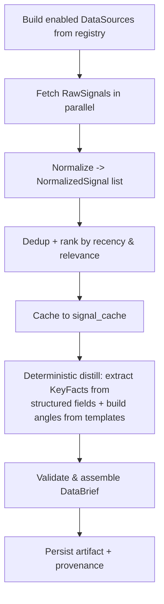

## 7. Agent 1 — Data Fetcher

### 7.1 Purpose
Ground the entire pipeline in **reality**. Agent 1 pulls fresh signals from external sources — a domain-agnostic **web search** by default (any niche), plus optional labor-market feeds (Adzuna/Layoffs/News/BLS) — normalizes them, then **deterministically** distills them into a structured, citation-ready `DataBrief` — **no LLM call**. Facts (numbers, titles, and snippets, each with its source URL) are extracted by code, which is free, fast, and guarantees zero hallucination. Everything downstream cites this brief.

### 7.2 Inputs / outputs
- **Input:** `topic_seed` (optional operator angle, e.g. "junior dev hiring"), `niche` (default from config), enabled source list.
- **Output:** `DataBrief` artifact → `output/runs/<run_id>/data_brief.json`.

### 7.3 Processing flow

1. **Fetch:** Each enabled `DataSource.fetch()` runs (`httpx` + `tenacity` retries). Sources: **Adzuna** (jobs/salary), **Layoffs** (RSS), **News**, **BLS**, and **Search** — a domain-agnostic web-search source that queries the run's topic (niche + idea) directly so **any** niche works, not just labor-market feeds (free via DuckDuckGo; optional Tavily/Brave for a stronger index). **Search fans out into multiple queries** — the base topic plus `SEARCH_QUERY_COUNT`-1 facet variants (`SEARCH_FACETS`, e.g. "topic salary", "topic statistics", "topic trends 2026") — whose hits are merged and de-duplicated by URL, so a run gathers many more *distinct*, number-rich facts instead of collapsing to a couple of near-duplicate headlines; a single failing angle is logged and skipped, and only a total wipe-out (every query errors) fails the source. Valid sources: `adzuna | layoffs | news | bls | search`. A failing source logs a warning and is skipped — the run continues with partial coverage.
2. **Normalize:** Source-specific payloads → uniform `NormalizedSignal` (`source`, `kind`, `title`, `value`, `unit`, `observed_at`, `url`, `raw`).
3. **Dedup & rank:** Drop near-duplicates; rank by recency × relevance to `niche`/`topic_seed`.
4. **Cache:** Store normalized signals in `signal_cache` (TTL `SIGNAL_CACHE_TTL_MIN`) to avoid hammering APIs during iteration.
5. **Distill (deterministic — no LLM):** Code maps each high-ranked `NormalizedSignal` to a `KeyFact` directly from its structured fields: `statement` is rendered from a small per-`kind` string template (e.g. salary, posting-trend, layoff), `metric`/`value`/`unit` are copied from the signal, and the `citation.snippet` is the signal text verbatim. **`content_angles`** are produced by an `angle_templates` table keyed on signal `kind` (e.g. a posting-decline signal → a "the bottom rung is gone" angle), filled with the concrete numbers. The distiller keeps up to **`MAX_FACTS`** of the highest-ranked signals as `KeyFact`s (and the run fails fast below **`MIN_FACTS`**), so the wider multi-query search feeds the script more distinct, grounded angles. Because every field is copied from real data, invented numbers are structurally impossible.

### 7.4 `DataBrief` schema (Pydantic)
```python
class Citation(BaseModel):
    source: str            # adzuna|layoffs|news|bls|search
    url: str | None
    observed_at: datetime
    snippet: str           # the exact normalized signal text supporting the fact

class KeyFact(BaseModel):
    statement: str         # e.g. "Median posted salary for X rose 8% QoQ"
    metric: str | None     # e.g. "median_salary"
    value: str | None      # e.g. "$112,000"
    citation: Citation     # MUST reference a real fetched signal

class ContentAngle(BaseModel):
    hook: str              # a sharp, specific premise for a video
    supporting_fact_ids: list[int]
    why_nonobvious: str    # justification this isn't generic advice

class DataBrief(BaseModel):
    schema_version: str = "1.0"
    run_id: str
    stage: Literal["data_brief"] = "data_brief"
    niche: str
    topic_seed: str | None
    key_facts: list[KeyFact]              # >= MIN_FACTS (default 3)
    content_angles: list[ContentAngle]    # >= 2
    coverage: dict[str, bool]             # which sources contributed
    gaps: list[str]                       # sources that failed / missing data
    generated_at: datetime
    provenance: Provenance
```

### 7.5 Grounding guarantees
- Every `KeyFact` **must** carry a `Citation` whose `snippet` came verbatim from a `NormalizedSignal`. Facts without citations are dropped before persistence.
- The agent records a `coverage` map and `gaps[]` so the Judge and operator can see exactly how well-grounded the run is.
- If fewer than `MIN_FACTS` grounded facts are produced, the agent raises `InsufficientDataError` (operator can lower the bar, add sources, or supply a hand-written brief).

### 7.6 Resumability hooks
- Produces a standalone `data_brief.json` the operator can read and edit by hand.
- Stage 2 accepts any valid `DataBrief` JSON via `--input`, so Agent 1 can be skipped entirely (e.g., operator pastes their own research).

### 7.7 Failure modes
| Failure | Handling |
|---------|----------|
| One source down/timeout | Log warning, skip, note in `gaps[]` |
| All sources down | Raise `NoDataError`; suggest cache reuse or manual brief |
| < `MIN_FACTS` grounded facts | Raise `InsufficientDataError` |

---

---
[← Index](README.md) · [← Prev](06-environment-variables-configuration.md) · [Next →](08-agent-2-script-generator.md)
