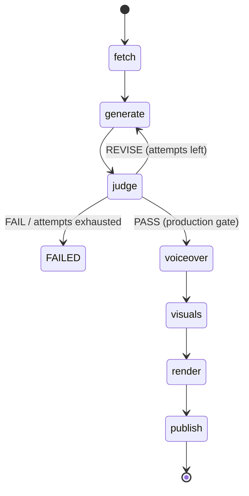

## 14. Pipeline Orchestrator

### 14.1 Purpose
The single component that knows the full sequence. It drives the run state machine, runs the Generator⇄Judge revision loop, enforces the production gate, and — critically — implements **resumability**: start at any stage, stop after any stage, feeding in the previous stage's (possibly hand-edited) artifact.

### 14.2 Stage registry
```python
STAGES = ["fetch", "generate", "judge", "voiceover", "visuals", "render", "publish"]
```
| Stage | Agent | Reads | Writes |
|-------|-------|-------|--------|
| `fetch` | Data Fetcher | (sources) | `data_brief.json` |
| `generate` | Script Generator | `data_brief.json` | `script.json` (+ `ideas.json`, `research.json`) |
| `judge` | Judge | `script.json` + `data_brief.json` | `judge_report.json` |
| `voiceover` | Voiceover | `script.json` | `voiceover.json` + audio |
| `visuals` | Visuals | `script.json` + `voiceover.json` | `visuals.json` + images |
| `render` | Renderer | `voiceover.json` + `visuals.json` | `video.json` + mp4 |
| `publish` | Publisher | `video.json` + `script.json` + `visuals.json` | `publish_result.json` |

> At the start of `generate`, before the first draft, the Brainstormer (Agent 0) proposes `BRAINSTORM_IDEA_COUNT` ideas focused by the operator's `--idea`; the pick (an interactive chooser on a TTY, else the first) **and the full generated list** are recorded to `ideas.json` (`IdeaSelection`) for provenance, and surfaced in `package.md`. The Researcher (Agent 1.5) then reads the pages behind the brief's sources and writes a source-backed depth report to `research.json`, folded into the generator's prompt to fuel deeper, more insightful scenes (toggle `RESEARCH_ENABLED`).

### 14.3 Resumability model (the core feature)
The orchestrator entry point:
```python
def run_pipeline(
    *,
    run_id: str | None = None,      # continue an existing run, or create new
    from_stage: str = "fetch",      # start here
    to_stage: str = "publish",      # stop after here
    input_path: str | None = None,  # artifact feeding the from_stage (prev stage's output)
    template_id: str | None = None,
    force: bool = False,            # bypass gates / re-run cached stages
    dry_run: bool = False,
) -> RunResult: ...
```
Rules:
1. If `from_stage != "fetch"`, an `input_path` (or existing run artifacts) **must** supply the prior artifact; it is schema-validated on load.
2. Stages run in `STAGES` order from `from_stage` to `to_stage` inclusive.
3. **Stop-after-k / resume-at-k+1:** run with `--to-stage k`, hand-edit the artifact, then run again with `--from-stage k+1 --run-id <same>`.
4. Cached outputs are reused when input hashes are unchanged, unless `--force`.



### 14.4 Revision loop
- Between `generate` and `judge`, the orchestrator loops up to `MAX_REVISIONS`.
- Each loop creates a new `attempts` row (incrementing `attempt_number`), passes the Judge's `revision_instructions` and any `forced_template_id`/`force_shift` back into the Generator.
- On `PASS`, the winning attempt is recorded as `runs.approved_attempt_id` and the gate opens.
- On exhaustion, the run is `FAILED` and surfaced to the operator/dashboard.

### 14.5 Production gate
Stages 4–7 execute **only** if the latest `JudgeReport.verdict == PASS` for the run, unless `--force` is passed (which is logged in provenance). This guarantees no compute is spent rendering/uploading a sub-par script.

### 14.6 Orchestrator responsibilities (summary)
- Create/lookup the run; transition `runs.state` after each stage.
- Persist each artifact (file + `artifacts` row + `content_hash` + provenance) via `pipeline/artifacts.py`.
- Detect operator hand-edits (hash mismatch) and re-stamp provenance as `source="operator_edited"`.
- Emit structured, run-scoped logs and a final `RunResult` (verdict, paths, youtube URL if any).
- Fire notifications on key transitions \u2014 `run_complete`, `need_validation` (a draft awaits go-live), `run_failed` ([Ch. 25](25-notifications-alerting.md#25-notifications--alerting)).
- Assemble `package.md` once `publish` (or `to_stage`) completes.

### 14.7 What it must NOT do
- It must not contain agent logic, prompt text, or vendor calls — it only sequences and persists. All "how" lives in the agents/providers.

---

---
[← Index](README.md) · [← Prev](13-agent-7-youtube-publisher.md) · [Next →](15-prompt-library.md)
